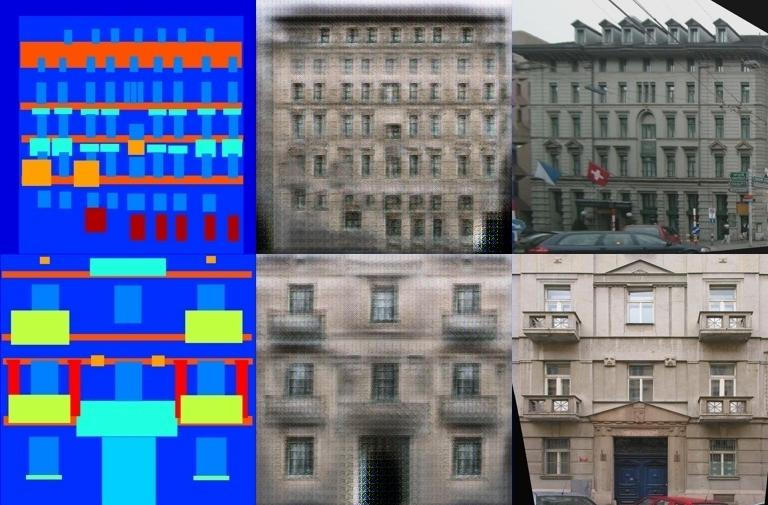

# Simplified pix2pixHD repo(Unofficial)

The simplified version of [this](https://github.com/NVIDIA/pix2pixHD/) code for quick prototyping.

# How to use this repo?
1. Download sources from github: `git clone https://github.com/Hramchenko/simplified_pix2pixHD.git`
2. Open [simplified_pix2pixHD.ipynb](./pix2pixHD.ipynb) in Jupyter.
3. Download images to `data` folder(for example [facades.tar.gz](http://efrosgans.eecs.berkeley.edu/pix2pix/datasets/facades.tar.gz) from [here](http://efrosgans.eecs.berkeley.edu/pix2pix/datasets/)).
4. Modify the `Dataset` class, the `generator` and the `discriminator` as you need.
5. Run Jupyter cells for training.

# Requirements
1. pytorch
2. opencv-python
3. numpy
4. matplotlib
